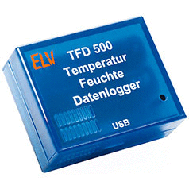
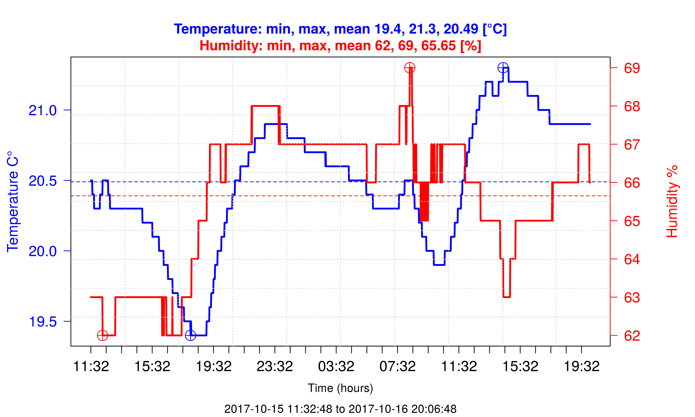

Command line tool for controlling ELV TFD500
==============

[](https://github.com/tstibor/tfd500/tags)
[](http://www.gnu.org/licenses/gpl-2.0.html)

The [ELV TFD500](https://www.elv.de/elv-temperatur-feuchte-datenlogger-tfd-500-bausatz.html) data logger collects temperature/humidity data for up to 590 days
(temperature only: up to 888 days) via an integrated sensor and makes these data available via a USB interface.



## Getting Started <a id="getting.started"></a>
Make sure your Linux kernel provides support for the TFD500 device
```
usb 7-1: New USB device found, idVendor=18ef, idProduct=e032
usb 7-1: New USB device strings: Mfr=1, Product=2, SerialNumber=3
usb 7-1: Product: TFD500
usb 7-1: Manufacturer: Silicon Labs
usb 7-1: SerialNumber: JCCBIAHE6OVJBC9F
usbcore: registered new interface driver usbserial
usbcore: registered new interface driver usbserial_generic
usbserial: USB Serial support registered for generic
usbcore: registered new interface driver cp210x
usbserial: USB Serial support registered for cp210x
cp210x 7-1:1.0: cp210x converter detected
usb 7-1: reset full-speed USB device number 2 using ohci-pci
usb 7-1: cp210x converter now attached to ttyUSB0
```

otherwise patch `drivers/usb/serial/cp210x.c` as shown below
and [recompile the module](#recompile.module) `cp210x`.
```
--- a/drivers/usb/serial/cp210x.c
+++ b/drivers/usb/serial/cp210x.c
@@ -170,6 +170,7 @@  static const struct usb_device_id id_tab
 	{ USB_DEVICE(0x1843, 0x0200) }, /* Vaisala USB Instrument Cable */
 	{ USB_DEVICE(0x18EF, 0xE00F) }, /* ELV USB-I2C-Interface */
 	{ USB_DEVICE(0x18EF, 0xE025) }, /* ELV Marble Sound Board 1 */
+	{ USB_DEVICE(0x18EF, 0xE032) }, /* ELV TFD500 Data Logger */
 	{ USB_DEVICE(0x1901, 0x0190) }, /* GE B850 CP2105 Recorder interface */
 	{ USB_DEVICE(0x1901, 0x0193) }, /* GE B650 CP2104 PMC interface */
 	{ USB_DEVICE(0x1901, 0x0194) },	/* GE Healthcare Remote Alarm Box */
```

Check out the repository and execute
```
./autogen.sh && ./configure && make
```

The compiled tool can be executed as follows:
```
./src/tfd500 
usage: ./src/tfd500 [options]
	-s, --status
	-r, --reset
	-c, --clear
	-f, --firmware
	-g, --gtime
	-t, --stime
	-e, --settings
	-u, --dump
	-h, --help
	-d, --device <string> [default: /dev/ttyUSB0]
	-i, --interval {10, 60, 300} secs
	-m, --mode {0, 1}, 0: temperature, 1: temperature and humidity
	-v, --verbose {error, warn, message, info, debug} [default: message]
version:  0.0.1 © 2017 by Thomas Stibor <thomas@stibor.net>
```

## Recompile cp210x Kernel Module <a id="recompile.module"></a>
```
make clean
make oldconfig
make prepare
make modules_prepare
make modules SUBDIRS=drivers/usb/serial modules
```

## Plot Temperature/Humidity Graph <a id="plot.graph"></a>
Collected data can be fetched with command
```
> ./src/tfd500 -u > tfd500.csv
```
and subsequently plot with the provided R script plot.R as follows
``` 
> ./src/plot.R tfd500.csv
``` 


## License
This project is licensed under the [GPL2 license](http://www.gnu.org/licenses/old-licenses/gpl-2.0.en.html).
